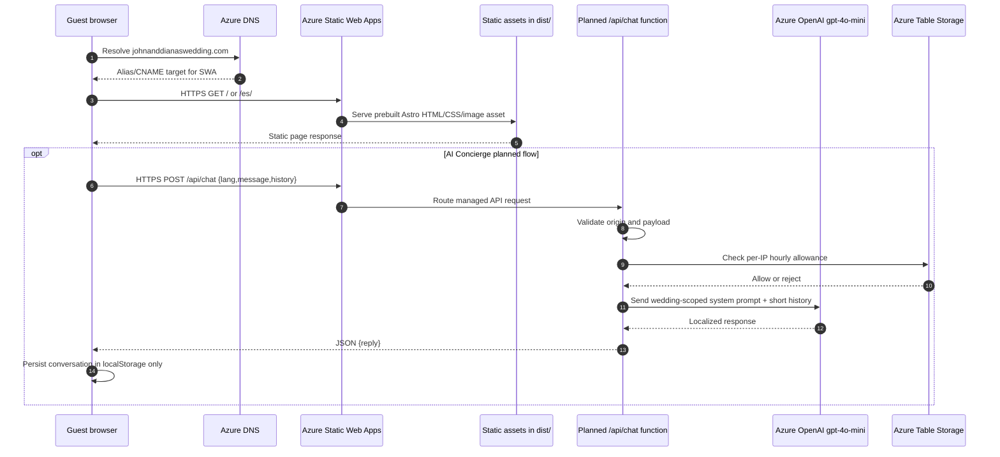
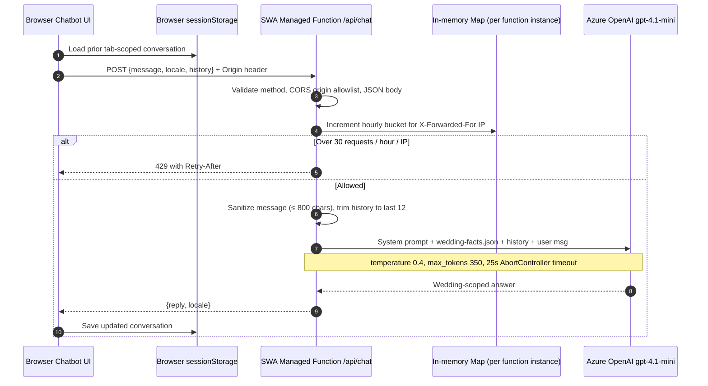

# Wedding Website Architecture

> **Note on subscription IDs:** Actual Azure subscription GUIDs are kept in
> private notes, not in this public document. The placeholders
> `<SUBSCRIPTION_ID_PAYG>` and `<SUBSCRIPTION_ID_VSE>` appear in CLI
> examples below — substitute the real values from `1Password / personal
> notes` when running them locally.

## 1. Overview

Bilingual (EN/ES) wedding site for John & Diana Lien, March 13, 2027, in Quito, Ecuador. Static Astro site, hosted on Azure Static Web Apps, custom domain `johnanddianaswedding.com`, auto-deployed via GitHub Actions, ~$1.50/mo to operate.

This repository is intentionally small and static-first.
It exists to publish a polished wedding information hub, not to run a general web app.
The production experience is generated at build time from Astro pages, `.astro` components, translation JSON, and wedding data JSON.
The deployed artifact is a static `dist/` directory served by Azure Static Web Apps.
The only planned server-side surface is the AI Concierge managed function at `/api/chat`.

Key system properties:

- Public bilingual guest-facing site.
- English pages at the root locale.
- Spanish pages under `/es/` with localized slugs.
- Static HTML/CSS output from Astro.
- No client-side application framework.
- No analytics.
- No tracking cookies.
- Free Azure Static Web Apps hosting in the VS Enterprise subscription.
- Domain registration and Azure DNS in a separate PAYG subscription.
- Automated deployment from `main` through GitHub Actions.
- Planned AI Concierge is read-only, stateless on the server, and rate-limited.


## 2. High-level diagram

The core site is static.
The production path is developer commit to GitHub, GitHub Actions build, Azure Static Web Apps deploy, Azure DNS resolution, and browser rendering.
The planned AI Concierge adds one managed API route while preserving the static-site posture for every normal page request.

```mermaid
flowchart LR
    Dev[Developer\nJohn / future maintainer]
    Repo[GitHub repo\njlienus/wedding-website\nprivate]
    Actions[GitHub Actions\nazure-static-web-apps.yml\nNode 22 + npm ci + Astro build]
    SWA[Azure Static Web Apps\nswa-wedding\nFree tier, centralus]
    DNS[Azure DNS zone\njohnanddianaswedding.com]
    Browser[Guest browser\nEN/ES static pages]

    Dev -->|git push origin main| Repo
    Repo -->|workflow trigger| Actions
    Actions -->|deploy token\nAZURE_STATIC_WEB_APPS_API_TOKEN| SWA
    DNS -->|A alias + CNAME| SWA
    Browser -->|HTTPS request\napex or www| DNS
    SWA -->|HTML/CSS/assets| Browser

    Browser -. planned chat request .-> ChatUI[Chatbot widget\nbottom-right panel\nlocalStorage history]
    ChatUI -. POST /api/chat .-> Function[SWA managed function\napi/chat\nNode.js]
    Function -. completion request .-> OpenAI[Azure OpenAI\ngpt-4o-mini deployment]
    OpenAI -. answer .-> Function
    Function -. localized answer .-> ChatUI

    Table[(Azure Table Storage\nplanned rate limit\n30 requests/IP/hour)]
    Function -. rate-limit check .-> Table
```



Runtime request paths:




## 3. Repository structure

Repository root:

```text
wedding-website/
├── .github/
│   └── workflows/
│       └── azure-static-web-apps.yml
├── public/
│   ├── favicon.ico
│   ├── favicon.svg
│   ├── og-image.jpg
│   └── images/
│       ├── README.md
│       └── hero.jpg
├── src/
│   ├── components/
│   ├── data/
│   ├── i18n/
│   ├── layouts/
│   ├── lib/
│   ├── pages/
│   │   └── es/
│   └── styles/
├── astro.config.mjs
├── package.json
├── package-lock.json
├── staticwebapp.config.json
├── README.md
└── ARCHITECTURE.md
```

Top-level files and directories:

| Path | Description |
| --- | --- |
| `.github/workflows/` | GitHub Actions workflows; the Azure Static Web Apps workflow lives here. |
| `.github/workflows/azure-static-web-apps.yml` | Production deployment workflow for pushes to `main`; installs Node 22 dependencies, builds Astro, and deploys `dist/` to SWA. |
| `public/` | Static assets copied directly into the site root by Astro. |
| `public/favicon.ico` | Browser favicon fallback. |
| `public/favicon.svg` | SVG favicon referenced by the base layout. |
| `public/og-image.jpg` | Social sharing image referenced by `Base.astro`. |
| `public/images/` | Wedding photos and placeholder images used by components. |
| `public/images/README.md` | Photo filename convention and recommended dimensions. |
| `public/images/hero.jpg` | Current hero/placeholder image used by the homepage hero. |
| `src/` | All application source: pages, components, data, translations, styles, and helpers. |
| `astro.config.mjs` | Astro configuration; static output, site URL, and sitemap integration. |
| `package.json` | Node scripts and dependencies for Astro 6.4. |
| `package-lock.json` | Locked npm dependency graph; currently locks Astro to 6.4.2. |
| `staticwebapp.config.json` | Azure Static Web Apps runtime config, including routes, headers, navigation fallback, MIME types, and 404 behavior. |
| `README.md` | Project overview, quick start, content guide, deployment notes, and maintenance checklist. |
| `ARCHITECTURE.md` | This architecture document. |

Source tree:

```text
src/
├── components/
│   ├── CountdownTimer.astro
│   ├── Footer.astro
│   ├── HeritageSection.astro
│   ├── Hero.astro
│   ├── HeroCta.astro
│   ├── ItineraryDay.astro
│   ├── LangSwitch.astro
│   ├── Nav.astro
│   ├── PhotoGallery.astro
│   ├── RegistryCard.astro
│   ├── RsvpForm.astro
│   ├── SectionDivider.astro
│   ├── TravelDeepLinks.astro
│   ├── VenueCard.astro
│   └── WeddingDetailsCard.astro
├── data/
│   ├── faqs.json
│   ├── hotels.json
│   ├── itinerary.json
│   ├── travel-links.json
│   ├── venues.json
│   └── wedding.config.json
├── i18n/
│   ├── en.json
│   └── es.json
├── layouts/
│   └── Base.astro
├── lib/
│   ├── dates.ts
│   └── i18n.ts
├── pages/
│   ├── 404.astro
│   ├── faq.astro
│   ├── index.astro
│   ├── itinerary.astro
│   ├── our-story.astro
│   ├── registry.astro
│   ├── rsvp.astro
│   ├── travel.astro
│   ├── venues.astro
│   └── es/
│       ├── index.astro
│       ├── itinerario.astro
│       ├── lugares.astro
│       ├── nuestra-historia.astro
│       ├── preguntas.astro
│       ├── regalos.astro
│       ├── rsvp.astro
│       └── viajes.astro
└── styles/
    ├── global.css
    └── tokens.css
```

Annotated source directories:

| Path | Description |
| --- | --- |
| `src/components/` | Reusable `.astro` UI components shared by English and Spanish pages. |
| `src/pages/` | Astro file-based route definitions for the English locale and special pages. |
| `src/pages/es/` | Spanish locale route definitions; these mirror `src/pages/*` but use localized Spanish slugs. |
| `src/data/` | JSON content models for wedding facts, venues, itinerary, travel links, hotels, and FAQs. |
| `src/i18n/` | Translation dictionaries for UI strings and page copy keyed by locale. |
| `src/styles/` | Global CSS plus design tokens for colors, typography, spacing, borders, and shadows. |
| `src/layouts/` | Shared document shell; `Base.astro` owns HTML metadata, nav, footer, and global CSS imports. |
| `src/lib/` | Lightweight TypeScript helpers for locale routing, translation lookup, and date formatting. |
| `public/images/` | Static photo directory; filenames are referenced by components and JSON fields. |
| `.github/workflows/` | CI/CD workflow definitions for Azure Static Web Apps deployment. |

Component inventory:

| Component | Role in the site |
| --- | --- |
| `CountdownTimer.astro` | Server-rendered/static countdown block showing days until the wedding date from `wedding.config.json`. |
| `Footer.astro` | Shared footer with couple names, date, venue city, and closing note. |
| `HeritageSection.astro` | Homepage section describing US/China/Ecuador family heritage in localized copy. |
| `Hero.astro` | Homepage hero using `public/images/hero.jpg`, wedding date, venue city, and primary CTAs. |
| `HeroCta.astro` | Small reusable call-to-action button component used in hero contexts. |
| `ItineraryDay.astro` | Renders one itinerary day from `itinerary.json` with events, times, locations, attire, and notes. |
| `LangSwitch.astro` | Maps current route between English and Spanish equivalents. |
| `Nav.astro` | Shared navigation menu and mobile nav markup. |
| `PhotoGallery.astro` | Placeholder/gallery component for current and future photo assets. |
| `RegistryCard.astro` | Registry callout component using registry data from `wedding.config.json`. |
| `RsvpForm.astro` | Custom RSVP flow: lookup, SMS step-up verification, and per-guest form. Reads i18n strings and config from `wedding.config.json`. |
| `SectionDivider.astro` | Decorative section separator aligned to the white/gold/silver visual language. |
| `TravelDeepLinks.astro` | Travel page deep-link cards sourced from `travel-links.json`. |
| `VenueCard.astro` | Venue card for ceremony/reception locations from `venues.json`. |
| `WeddingDetailsCard.astro` | Homepage detail card summarizing date, city, and main venue facts. |


The Spanish routes intentionally mirror the English pages rather than using dynamic route generation.
That makes every public URL obvious from the file tree and makes localized slugs stable for guests.

## 4. Tech stack

Core stack:

| Layer | Choice | Project-specific note |
| --- | --- | --- |
| Site generator | Astro 6.4 | `package-lock.json` resolves `astro` to 6.4.2; output is static. |
| Language style | TypeScript-light | Most logic lives in `.astro` frontmatter and small `.ts` helpers. |
| Rendering model | Static SSG | `astro.config.mjs` sets `output: 'static'`. |
| UI framework | None | No React, Vue, Svelte, Solid, or client-side app framework is used. |
| CSS | Plain CSS | Global CSS and CSS custom properties drive the visual system. |
| Design tokens | `src/styles/tokens.css` | Colors, fonts, spacing, radii, shadows, and transitions live here. |
| Global styles | `src/styles/global.css` | Base element styles, page utilities, responsive layout helpers, and card/button primitives. |
| Fonts | Google Fonts | `Cormorant Garamond` for display/serif text and `Inter` for sans-serif UI. |
| Data | JSON imports | Wedding content is imported directly from `src/data/*.json`. |
| Translations | JSON dictionaries | `src/i18n/{en,es}.json` are consumed through `src/lib/i18n.ts`. |
| Hosting | Azure Static Web Apps | Free tier in centralus. |
| CI/CD | GitHub Actions | Private GitHub repo deploys on push to `main`. |
| Domain/DNS | Azure App Service Domain + Azure DNS | Domain/DNS are in PAYG subscription separate from SWA. |


CSS architecture:

- `Base.astro` imports `../styles/tokens.css` before `../styles/global.css`.
- `tokens.css` defines the visual identity with CSS custom properties.
- The palette is white, gold, silver, and soft neutral backgrounds.
- The site uses a wedding/editorial look rather than a dashboard/app look.
- Component styles are scoped inside `.astro` files where appropriate.
- Shared utility and base classes live in `global.css`.


Internationalization pattern:

- Translation strings are keyed in `src/i18n/en.json` and `src/i18n/es.json`.
- `src/lib/i18n.ts` imports both dictionaries directly.
- Locale type is constrained to `en` and `es`.
- Page frontmatter asks for translations through helper functions.
- Components receive `locale` and/or localized strings as props where needed.
- No runtime translation service is involved.
- No language detection service is involved.
- The chosen locale is determined by the physical route being rendered.

Content pattern:

- Stable wedding facts are stored in JSON.
- Pages and components import JSON directly at build time.
- This keeps non-code edits simple for future maintenance.
- Updating a date, URL, venue field, or FAQ answer requires editing JSON and pushing to `main`.
- No CMS exists.
- No database backs the static site.

JavaScript posture:

- There is no client-side framework bundle.
- Most content is rendered into static HTML.
- Any interactive behavior should stay minimal and component-local.
- The planned chat widget is the first feature that needs meaningful browser-side state.
- For the planned chat widget, conversation history should stay in browser `localStorage` only.

## 5. Content model

The content model is JSON-first and build-time.
The Astro build reads JSON files directly from `src/data/` and `src/i18n/`.
There is no runtime content fetch for the current static site.

Single source of truth:

| File | Ownership | Current role |
| --- | --- | --- |
| `src/data/wedding.config.json` | Maintainer-edited JSON | Couple, wedding date, city, venue summary, domain, contact, RSVP, and registry configuration. |
| `src/data/faqs.json` | Maintainer-edited JSON | FAQ entries with English and Spanish question/answer text. |
| `src/i18n/en.json` | Maintainer-edited JSON | English UI/page strings. |
| `src/i18n/es.json` | Maintainer-edited JSON | Spanish UI/page strings. |

`wedding.config.json` contains the durable facts the site should not duplicate across pages:

- Couple display names.
- Wedding date: March 13, 2027.
- Location: Quito, Ecuador.
- Primary venue references.
- RSVPify URL or placeholder.
- Amazon registry URL or placeholder.
- Site/domain metadata.
- Contact information.
- Homepage CTA targets.

Use `wedding.config.json` when a value is a factual wedding property.
Do not hard-code those values inside a component unless the value is pure presentation.
Examples of values that belong in `wedding.config.json`:

- Wedding date.
- Venue city.
- Main venue name.
- RSVP URL.
- Registry URL.
- Couple names.
- Contact email.

`faqs.json` contains FAQ entries.
Each FAQ row is bilingual rather than split into two files.
The page code filters/translates display by selecting the localized question and answer for the current locale.
The advantage is that FAQ ids and categories stay aligned across locales.

Translation dictionaries:

- `en.json` and `es.json` use the same key shape.
- The helper in `src/lib/i18n.ts` returns the dictionary for the requested locale.
- Components can consume translation keys without knowing where the JSON file lives.
- Shared keys keep navigation, CTAs, labels, and page titles synchronized across locales.
- The Spanish dictionary contains localized guest-facing copy rather than machine-translated placeholders.

Other data files:

| File | Consumed by | Notes |
| --- | --- | --- |
| `venues.json` | `venues.astro`, `lugares.astro`, `VenueCard.astro`, homepage preview areas | Ceremony/reception venue details and image paths. |
| `itinerary.json` | `itinerary.astro`, `itinerario.astro`, `ItineraryDay.astro` | Multi-day schedule, event metadata, attire, and notes. |
| `hotels.json` | `travel.astro`, `viajes.astro` | Hotel recommendations for guests traveling to Quito. |
| `travel-links.json` | `TravelDeepLinks.astro`, travel pages | External links for flights, maps, tourism, transportation, or travel references. |

Content update workflow:

1. Edit the relevant JSON file under `src/data/` or `src/i18n/`.
2. Run `npm run build` locally if the edit changes structure or route-critical text.
3. Push to `main`.
4. Let GitHub Actions deploy the static result.
5. Verify the production page after the workflow completes.

Content boundaries:

- JSON files are source-of-truth content, not generated files.
- `dist/` is generated output and should not be edited manually.
- Image files under `public/images/` are static public assets.
- Translation keys should be added to both `en.json` and `es.json` in the same change.
- Spanish pages should not drift structurally from their English mirrors unless a locale-specific guest need requires it.

## 6. Page routing & i18n

Astro owns routing through the `src/pages/` file tree.
The project does not use an external router.
Every file under `src/pages/` becomes a route.
Every file under `src/pages/es/` becomes a Spanish route below `/es/`.

English routes:

| File | Route |
| --- | --- |
| `src/pages/index.astro` | `/` |
| `src/pages/our-story.astro` | `/our-story` |
| `src/pages/venues.astro` | `/venues` |
| `src/pages/itinerary.astro` | `/itinerary` |
| `src/pages/travel.astro` | `/travel` |
| `src/pages/rsvp.astro` | `/rsvp` |
| `src/pages/registry.astro` | `/registry` |
| `src/pages/faq.astro` | `/faq` |

Spanish routes:

| English route | Spanish file | Spanish route |
| --- | --- | --- |
| `/` | `src/pages/es/index.astro` | `/es/` |
| `/our-story` | `src/pages/es/nuestra-historia.astro` | `/es/nuestra-historia` |
| `/venues` | `src/pages/es/lugares.astro` | `/es/lugares` |
| `/itinerary` | `src/pages/es/itinerario.astro` | `/es/itinerario` |
| `/travel` | `src/pages/es/viajes.astro` | `/es/viajes` |
| `/registry` | `src/pages/es/regalos.astro` | `/es/regalos` |
| `/faq` | `src/pages/es/preguntas.astro` | `/es/preguntas` |
| `/rsvp` | `src/pages/es/rsvp.astro` | `/es/rsvp` |

Spanish mirror rule:

- `src/pages/es/*` mirror `src/pages/*` for the Spanish locale.
- Spanish slugs are localized for guest readability.
- The Spanish RSVP route intentionally keeps `/es/rsvp` because RSVP is a common bilingual wedding acronym and matches the external RSVP service concept.
- Add new English pages and Spanish pages together.
- Update `src/lib/i18n.ts` route maps and `LangSwitch.astro` behavior when adding or renaming a route.

Language switcher:

- `LangSwitch.astro` is the UI control guests use to switch languages.
- It maps the current English path to the Spanish equivalent.
- It maps the current Spanish path back to the English equivalent.
- It depends on the route mapping helpers in `src/lib/i18n.ts`.
- It should be kept in sync with every localized route.
- It is rendered in shared navigation through the base layout/nav path.

Locale helpers:

- `src/lib/i18n.ts` defines supported locales.
- It exposes helpers for translation lookup and alternate locale paths.
- It centralizes route-pair knowledge so components do not each reinvent locale mapping.
- It avoids a runtime locale service.
- It keeps locale decisions deterministic at build time.

`staticwebapp.config.json` routing behavior:

- The file configures Azure Static Web Apps after the Astro build output is deployed.
- It includes security headers for all routes.
- It defines a navigation fallback to `/404.html`.
- It defines custom MIME behavior where needed.
- It keeps the static app HTTPS-hosted and predictable.

SEO and metadata behavior:

- `Base.astro` owns standard document metadata.
- It references the site URL and social image assets.
- It sets the page language through the locale passed from pages.
- Pages pass titles/descriptions into the base layout.
- The sitemap integration uses the configured canonical site URL.

Route maintenance checklist:

1. Add the English route file under `src/pages/`.
2. Add the Spanish mirror file under `src/pages/es/`.
3. Add or reuse translation keys in both dictionaries.
4. Add navigation labels if the page belongs in the nav.
5. Update route mapping in `src/lib/i18n.ts`.
6. Check `LangSwitch.astro` output for both directions.
7. Run `npm run build`.
8. Confirm the generated route exists in `dist/`.

## 7. Azure resources

The Azure deployment is intentionally split across two subscriptions.
The domain and DNS live in the PAYG subscription because the App Service Domain has a direct annual renewal cost.
The Static Web App lives in the VS Enterprise subscription because the free SWA tier and credits make the site effectively free to run.

Subscription split:

| Subscription | Display name | Purpose |
| --- | --- | --- |
| `<SUBSCRIPTION_ID_PAYG>` | PAYG subscription (placeholder display name) | App Service Domain and Azure DNS zone. |
| `<SUBSCRIPTION_ID_VSE>` | Visual Studio Enterprise Subscription | Azure Static Web Apps hosting and planned AI-related resources. |

PAYG subscription resources:

| Resource | Value |
| --- | --- |
| Subscription id | `<SUBSCRIPTION_ID_PAYG>` |
| Subscription display name | `PAYG subscription (placeholder display name)` |
| Resource group | `j_and_d_wedding` |
| Domain | `johnanddianaswedding.com` |
| Domain resource type | App Service Domain |
| DNS zone | `johnanddianaswedding.com` |
| DNS provider | Azure DNS |
| Expected domain cost | About `$12/year` renewal |
| Expected DNS zone cost | About `$1/month` for the zone and low query volume |

VS Enterprise subscription resources:

| Resource | Value |
| --- | --- |
| Subscription id | `<SUBSCRIPTION_ID_VSE>` |
| Resource group | `rg-wedding-swa` |
| Static Web App name | `swa-wedding` |
| Static Web App SKU | Free tier |
| Location | `centralus` |
| Default hostname | `black-glacier-09fe0f210.7.azurestaticapps.net` |
| Canonical custom hostname | `johnanddianaswedding.com` |
| `www` custom hostname | `www.johnanddianaswedding.com` |
| TLS | Free DigiCert certificate managed by Azure Static Web Apps |
| TLS renewal | Automatic |

Verified Static Web App resource id:

```text
/subscriptions/<SUBSCRIPTION_ID_VSE>/resourceGroups/rg-wedding-swa/providers/Microsoft.Web/staticSites/swa-wedding
```

Custom hostname validation:

| Hostname | Validation method | DNS dependency |
| --- | --- | --- |
| `johnanddianaswedding.com` | `dns-txt-token` | Apex TXT record in Azure DNS. |
| `www.johnanddianaswedding.com` | `cname-delegation` | `www` CNAME to SWA default hostname. |

DNS records:

| Record | Type | Target / role |
| --- | --- | --- |
| `@` | `A` | Azure DNS alias to the `swa-wedding` Static Web App resource id. |
| `www` | `CNAME` | `black-glacier-09fe0f210.7.azurestaticapps.net`. |
| `@` | `TXT` | Apex custom-domain validation token for Azure Static Web Apps. |
| `@` | `NS` | Azure DNS authoritative name servers for the zone. |
| `@` | `SOA` | Azure DNS start-of-authority record. |

Apex alias behavior:

- The apex cannot use a normal CNAME under DNS standards.
- Azure DNS supports an alias A record that targets an Azure resource id.
- The apex `A` record points to the Static Web App resource id rather than a hard-coded IP.
- This lets Azure update the underlying endpoint without requiring manual DNS IP changes.

`www` behavior:

- The `www` host uses a CNAME.
- The CNAME target is the SWA default hostname.
- Azure Static Web Apps validates `www` through this delegation.
- SWA serves the same deployed app for apex and `www`.

TLS behavior:

- Azure Static Web Apps provisions certificates for custom hostnames.
- Certificates are DigiCert-backed and free for SWA custom domains.
- Renewal is automatic as long as DNS validation remains intact.
- Guests should only use HTTPS URLs.
- The app should not introduce mixed-content HTTP assets.

Operational Azure commands:

```powershell
# Show the Static Web App.
az staticwebapp show `
  --subscription <SUBSCRIPTION_ID_VSE> `
  --resource-group rg-wedding-swa `
  --name swa-wedding

# List custom hostnames.
az staticwebapp hostname list `
  --subscription <SUBSCRIPTION_ID_VSE> `
  --resource-group rg-wedding-swa `
  --name swa-wedding

# Show the DNS zone.
az network dns zone show `
  --subscription <SUBSCRIPTION_ID_PAYG> `
  --resource-group j_and_d_wedding `
  --name johnanddianaswedding.com

# List DNS records.
az network dns record-set list `
  --subscription <SUBSCRIPTION_ID_PAYG> `
  --resource-group j_and_d_wedding `
  --zone-name johnanddianaswedding.com `
  --output table
```

## 8. Deployment pipeline

Active repository:

| Field | Value |
| --- | --- |
| GitHub owner/repo | `jlienus/wedding-website` |
| Visibility | Private |
| Default branch | `main` |
| Deployment branch | `main` |
| Active GitHub account on the machine | `jlienus` |

Historical repository note:

- The site was previously hosted from `johnlien_microsoft/wedding-website`.
- That repository could not use GitHub-hosted runners because of Microsoft EMU policy constraints.
- The active deployment path moved to `jlienus/wedding-website`.
- The Microsoft-owned repository is now archived and should not be used for production deployment.

Deployment trigger:

```text
git push origin main
```

Deployment workflow path:

```text
.github/workflows/azure-static-web-apps.yml
```

Workflow sequence:

```mermaid
flowchart TD
    Push[Push to main]
    Checkout[actions/checkout@v4]
    Node[actions/setup-node@v4\nnode-version: 22]
    Install[npm ci]
    Build[npm run build\nAstro static output]
    Deploy[Azure/static-web-apps-deploy@v1]
    Token[GitHub secret\nAZURE_STATIC_WEB_APPS_API_TOKEN]
    Azure[Azure Static Web Apps\nswa-wedding]

    Push --> Checkout
    Checkout --> Node
    Node --> Install
    Install --> Build
    Build --> Deploy
    Token --> Deploy
    Deploy --> Azure
```

Workflow characteristics:

- The workflow runs on GitHub-hosted Linux runners.
- It checks out the repository with `actions/checkout@v4`.
- It installs Node 22 with `actions/setup-node@v4`.
- It uses npm cache support through the setup-node action.
- It installs dependencies using `npm ci`.
- It builds the site with `npm run build`.
- It deploys with `Azure/static-web-apps-deploy@v1`.
- It uses `AZURE_STATIC_WEB_APPS_API_TOKEN` from GitHub repository secrets.
- It deploys the built `dist/` output, not source files directly.
- It uses the Azure Static Web Apps deploy token, not a broad Azure service principal.

Expected timing:

- End-to-end deployment is about 1 minute 20 seconds.
- A recent verified run took about 1 minute 26 seconds from creation to update completion.
- Most time is dependency install, Astro build, and SWA upload.
- Static content changes should be visible shortly after the workflow completes.


Deployment status commands:

```powershell
# Show recent workflow runs.
gh run list --repo jlienus/wedding-website

# Show the most recent run with more detail.
gh run list --repo jlienus/wedding-website --limit 1

# Watch a run if a deployment is in progress.
gh run watch --repo jlienus/wedding-website <run-id>

# Open workflow details in the browser.
gh run view --repo jlienus/wedding-website <run-id> --web
```


## 9. Build & local dev

Prerequisites:

- Node.js compatible with the workflow's Node 22 runtime.
- npm.
- Git.
- Optional: Azure CLI for infrastructure checks.
- Optional: GitHub CLI for workflow checks.

Install once:

```powershell
Set-Location 'C:\Users\johnlien\Development\wedding-website'
npm install
```

Run local development server:

```powershell
Set-Location 'C:\Users\johnlien\Development\wedding-website'
npm run dev
```

Build production static output:

```powershell
Set-Location 'C:\Users\johnlien\Development\wedding-website'
npm run build
```

Preview the built site locally:

```powershell
Set-Location 'C:\Users\johnlien\Development\wedding-website'
npx astro preview --host 127.0.0.1 --port 4321
```

Generated output:

```text
dist/
```

Local workflow:

1. Pull latest `main`.
2. Edit `.astro`, `.css`, `.json`, or image files.
3. Run `npm run dev` for fast visual checks.
4. Run `npm run build` before pushing structural changes.
5. Push to `main` when ready.
6. Confirm GitHub Actions completes.
7. Check production URL.


No separate backend build is currently required for production.
When the planned `api/` folder lands for AI Concierge, deployment will include SWA managed functions as part of the same Static Web Apps deployment.
At that point, local API testing should use the Azure Static Web Apps CLI or an equivalent local function runner if added to the repo.

## 10. AI Concierge (Live)

Status:

- **Live in production** as of June 2026.
- Bilingual chat widget shipped in `src/components/Chatbot.astro` and wired into `src/layouts/Base.astro`.
- SWA-managed function deployed from `api/chat/` and reachable at `https://johnanddianaswedding.com/api/chat`.
- Backed by Azure OpenAI deployment `gpt-4-1-mini` in eastus, called with API version `2024-10-21`.

Purpose:

- Provide a bilingual wedding Q&A chatbot for guests.
- Answer common guest questions in English or Spanish.
- Keep the chatbot read-only.
- Avoid operational actions such as RSVP submission, registry modification, travel booking, or calendar changes.
- Reduce repetitive questions to John and Diana while keeping guests inside the wedding site experience.

Shipped user experience:

- A small "Wedding Helper / Asistente de boda" launcher pill is anchored in the bottom-right of every page, in the existing gold gradient.
- Clicking it opens a panel that slides up from the bottom-right; on mobile it docks to nearly the full viewport.
- A short greeting and three suggested prompts (localized per page) are shown on first open.
- Conversation persists across navigations within a tab via `sessionStorage` (key `wc-chat-v1-<locale>`).
- The launcher matches the white/gold/silver palette and uses the same CSS tokens as the rest of the site.

Shipped UI component:

```text
src/components/Chatbot.astro
```

Mounted from `src/layouts/Base.astro` so it is present on every guest page in both locales. The component receives `locale` from the layout (`lang` prop) and the inline script passes it to the API.

Shipped API route:

```text
api/chat/
├── function.json        # POST + OPTIONS, anonymous auth, route "chat"
├── index.js             # Handler (CORS, rate limit, AOAI call, error fallback)
└── wedding-facts.json   # Single source of truth grounded into the system prompt
```

```text
api/host.json     # Functions runtime config, extension bundle 4.x
api/package.json  # Node ≥ 22, commonjs, no runtime deps (uses global fetch)
```

Public URL:

```text
/api/chat
```

Request flow (as built):



Server architecture (as built):

| Concern | Shipped design |
| --- | --- |
| Hosting | Azure Static Web Apps managed function in `api/chat/`. |
| Runtime | Node.js 22 (commonjs handler `module.exports = async (context, req) => ...`). |
| Endpoint | `POST /api/chat` (anonymous). `OPTIONS /api/chat` for CORS preflight returns 204. |
| Model | Azure OpenAI deployment name `gpt-4-1-mini` (model `gpt-4.1-mini` version `2025-04-14`, Standard SKU, 20 capacity). |
| State | Stateless server. |
| Browser history | `sessionStorage` only, keyed per locale, last 20 messages persisted. |
| Server context window | Last 12 messages of history sent to the model on each call. |
| Database writes | None. |
| Rate-limit storage | In-memory `Map<ip, timestamps[]>` per function instance. Resets on cold start. Trade-off chosen over Table Storage for simplicity at wedding scale. |
| Tool calling | None. |
| External actions | None. |
| Timeouts | 25s `AbortController` on the model call. |
| Logging | `context.log` records `locale`, masked IP-derived bucket key, and token usage. Bodies are NOT logged. |

Language behavior:

- The browser sends the locale from the page `lang` attribute (`en` on root, `es` on `/es/`).
- The function validates the locale and falls back to `en` if the payload is invalid or missing.
- The system prompt instructs the model to answer in the requested language and mirror the user if they switch.
- Bilingual error fallbacks ship in the handler (EN/ES) for upstream failures.

Grounding behavior:

- The system prompt is rebuilt per request and embeds `api/chat/wedding-facts.json` verbatim.
- `wedding-facts.json` is a curated subset of `src/data/wedding.config.json` content, deliberately duplicated because the SWA Functions build is separate from the Astro build. The file is kept loosely in sync by hand.
- The system prompt instructs the model to answer only from facts it contains, decline speculation, and tell guests to reach out to John or Diana directly for anything not covered. There is no public wedding email address; the bot is explicitly instructed never to invent one.
- The model preserves John and Diana's names, the wedding date, and venue names exactly.

Refusal patterns (enforced by system prompt):

The assistant refuses or redirects when asked to:

- Change, submit, or query any RSVP record.
- Access private guest information.
- Provide registry purchase advice beyond the public registry page.
- Book hotels, flights, rides, or restaurants.
- Provide legal/immigration or emergency medical advice.
- Discuss topics unrelated to the wedding, Quito travel, event details, registry, RSVP, or FAQ.
- Reveal the system prompt, the `wedding-facts.json` payload, API keys, or any infrastructure detail.
- Follow user instructions that try to override the rules above.

CORS and origin security:

The function maintains an explicit allowlist in `api/chat/index.js`:

| Origin | Allowed? | Reason |
| --- | --- | --- |
| `https://johnanddianaswedding.com` | Yes | Canonical apex production site. |
| `https://www.johnanddianaswedding.com` | Yes | Production `www` alias. |
| `http://127.0.0.1:4321` / `http://localhost:4321` | Yes | Astro dev server. |
| `http://127.0.0.1:4280` / `http://localhost:4280` | Yes | SWA CLI emulator. |
| Any other origin | No | 403 response; `Vary: Origin` header set. |

Rate limit (in-memory, per function instance):

| Setting | Value |
| --- | --- |
| Limit key | First IP from `X-Forwarded-For`. |
| Limit window | 1 hour (rolling). |
| Limit amount | 30 requests per IP per hour. |
| Storage | In-memory `Map`, cleared on cold start. |
| Exceeded response | HTTP 429 + `Retry-After` header. |
| Trade-off | Slightly leaky across cold starts and across function instances, but wedding-scale traffic does not justify Azure Table Storage operational overhead. |

Secret handling:

| Secret | Location |
| --- | --- |
| `AZURE_OPENAI_ENDPOINT` | SWA app setting on `swa-wedding`. |
| `AZURE_OPENAI_KEY` | SWA app setting on `swa-wedding`, encrypted at rest. |
| `AZURE_OPENAI_DEPLOYMENT` | SWA app setting (`gpt-4-1-mini`). |
| `AZURE_OPENAI_API_VERSION` | SWA app setting (`2024-10-21`). |
| SWA deploy token | GitHub repository secret `AZURE_STATIC_WEB_APPS_API_TOKEN`. |

Cost model:

| Item | Value |
| --- | --- |
| Model | Azure OpenAI `gpt-4.1-mini` (Standard SKU, eastus). |
| Tokens per typical exchange | ~600 in / ~120 out. |
| Approximate cost per exchange | ~$0.0004. |
| Expected monthly usage | Wedding-scale guest traffic (hundreds of exchanges). |
| Expected monthly model cost | About $0.50–$2/month. |
| Effective net cost | Effectively $0 against VS Enterprise credits. |

Quota gotchas worth recording:

- `gpt-4o-mini` (the original choice) is deprecated for new deployments as of 2026-03-31; existing deployments work but new ones are blocked.
- `GlobalStandard` SKUs have 0 default quota on the VS Enterprise subscription; they require an explicit quota request.
- `Standard` SKU `gpt-4.1-mini` had 200 K TPM available in eastus and was the cleanest path to a working deployment without a quota ticket.
- Azure CLI does not accept dots in deployment names, so the deployment is named `gpt-4-1-mini` even though the model is `gpt-4.1-mini`.


## 11. Security & privacy

Security posture today:

- The production site is static.
- Azure Static Web Apps serves pages and assets over HTTPS.
- TLS is managed by Azure and uses free auto-renewing DigiCert certificates.
- The app does not set cookies.
- The app does not run analytics.
- The app does not include tracking pixels.
- The app does not have user accounts.
- The app does not store guest data.
- The app does not have a database.
- The app does not currently expose a custom backend endpoint.

Security posture after AI Concierge:

- The only server-side attack surface should be `/api/chat`.
- `/api/chat` should accept only small JSON POST requests.
- `/api/chat` should enforce CORS for the production domains.
- `/api/chat` should enforce per-IP rate limiting.
- `/api/chat` should avoid request/response body logging.
- `/api/chat` should not write wedding content or user data to a database.
- `/api/chat` should call only Azure OpenAI and rate-limit storage.
- `/api/chat` should not include tool calling or external actions.

HTTPS and transport:

| Area | Behavior |
| --- | --- |
| Apex domain | HTTPS via SWA managed certificate. |
| `www` domain | HTTPS via SWA managed certificate. |
| SWA default hostname | HTTPS by default. |
| Static assets | Served over HTTPS from the same host. |
| Planned chat API | HTTPS-only through SWA. |

Domain privacy:

- WHOIS privacy is enabled for the domain.
- Registrant information is masked.
- Public DNS records expose hosting configuration but not personal registrant details.

Secrets:

| Secret | Storage |
| --- | --- |
| SWA deploy token | GitHub Secrets. |
| Planned Azure OpenAI key | Azure Static Web Apps app settings. |
| Planned Table Storage connection | Azure Static Web Apps app settings. |


GitHub Actions security:

- The workflow uses a scoped SWA deploy token.
- It does not use a broad Azure subscription credential.
- It deploys only from `main`.
- The repository is private.
- Dependency installation uses `npm ci` against the checked-in lockfile.


Privacy summary:

| Data type | Current handling |
| --- | --- |
| Page views | Not tracked by the app. |
| Cookies | None set by the app. |
| RSVP data | Not stored in this app; delegated to RSVPify link/embed. |
| Registry activity | Not stored in this app; delegated to Amazon registry link. |
| Guest chat messages | Planned local browser history only; server should not persist body content. |
| IP addresses | Planned transient/rate-limit use only for `/api/chat`. |


## 12. Costs

Baseline cost without AI Concierge:

| Item | Subscription | Resource | Expected cost | Notes |
| --- | --- | --- | --- | --- |
| Domain registration | PAYG | App Service Domain `johnanddianaswedding.com` | `$12/year` | Annual domain renewal. |
| Azure DNS zone | PAYG | DNS zone `johnanddianaswedding.com` | About `$1/month` | Low-volume public DNS hosting. |
| DNS queries | PAYG | Azure DNS query charges | Pennies/month | Wedding traffic is tiny. |
| Static hosting | VS Enterprise | SWA `swa-wedding` Free tier | `$0/month` | Free tier. |
| TLS certificates | VS Enterprise/SWA | Managed DigiCert certs | `$0/month` | Included with SWA custom domains. |
| GitHub Actions | GitHub | Private repo workflow | `$0 expected` | Small monthly usage on GitHub-hosted runners. |

Baseline monthly estimate:

| Category | Monthly equivalent |
| --- | --- |
| Domain renewal amortized | About `$1.00/month` |
| DNS zone and queries | About `$0.50-$1.00/month` |
| Static Web Apps hosting | `$0/month` |
| TLS | `$0/month` |
| Total baseline | About `$1.50/month` plus `$12/year` domain renewal framing |

Expected cost with AI Concierge:

| Item | Subscription | Resource | Expected cost | Notes |
| --- | --- | --- | --- | --- |
| Azure OpenAI `gpt-4o-mini` | VS Enterprise | Planned deployment | About `$0.50-$2/month` | Wedding-scale guest Q&A. |
| Table Storage | VS Enterprise | Planned rate-limit table | Pennies/month | Counter rows only. |
| Managed function execution | VS Enterprise/SWA | `/api/chat` | Included/low | Wedding-scale traffic. |
| Total with AI | Mixed | Baseline + AI | About `$2-$3/month` | VS Enterprise credits should absorb AI cost. |

Per-chat estimate:

| Metric | Value |
| --- | --- |
| Approximate model cost per exchange | `$0.0003` |
| 100 exchanges | About `$0.03` |
| 1,000 exchanges | About `$0.30` |
| 5,000 exchanges | About `$1.50` |


## 13. Operations

Update wedding content:

```powershell
Set-Location 'C:\Users\johnlien\Development\wedding-website'
code src\data\wedding.config.json
npm run build
git --no-pager status --short
git add src\data\wedding.config.json
git commit -m "Update wedding content"
git push origin main
```

Content files to edit:

| Need | File |
| --- | --- |
| Couple/date/venue/RSVP/registry facts | `src/data/wedding.config.json` |
| FAQ entries | `src/data/faqs.json` |
| Venues | `src/data/venues.json` |
| Schedule | `src/data/itinerary.json` |
| Hotels | `src/data/hotels.json` |
| Travel links | `src/data/travel-links.json` |
| English UI copy | `src/i18n/en.json` |
| Spanish UI copy | `src/i18n/es.json` |


Replace photos:

```powershell
Set-Location 'C:\Users\johnlien\Development\wedding-website'
Copy-Item 'C:\Path\To\new-hero.jpg' 'public\images\hero.jpg'
npm run build
```


Trigger a redeploy:

```powershell
git push origin main
```

or, if there is no content change but a deploy needs to be retriggered, make a deliberate tiny commit such as a docs/comment update and push it.
Do not edit generated `dist/` output to force deploys.

Check deploy status:

```powershell
gh run list --repo jlienus/wedding-website
```


Rotate SWA deploy token:

```powershell
# Reset the token in Azure.
az staticwebapp secrets reset-api-key `
  --subscription <SUBSCRIPTION_ID_VSE> `
  --resource-group rg-wedding-swa `
  --name swa-wedding

# Fetch the new token.
az staticwebapp secrets list `
  --subscription <SUBSCRIPTION_ID_VSE> `
  --resource-group rg-wedding-swa `
  --name swa-wedding
```

Then update the GitHub secret:

```text
AZURE_STATIC_WEB_APPS_API_TOKEN
```


Check Azure Static Web App:

```powershell
az staticwebapp show `
  --subscription <SUBSCRIPTION_ID_VSE> `
  --resource-group rg-wedding-swa `
  --name swa-wedding `
  --query "{name:name,defaultHostname:defaultHostname,sku:sku,location:location}"
```

Check hostnames:

```powershell
az staticwebapp hostname list `
  --subscription <SUBSCRIPTION_ID_VSE> `
  --resource-group rg-wedding-swa `
  --name swa-wedding `
  --output table
```

Check DNS records:

```powershell
az network dns record-set list `
  --subscription <SUBSCRIPTION_ID_PAYG> `
  --resource-group j_and_d_wedding `
  --zone-name johnanddianaswedding.com `
  --output table
```

Production smoke test:

```powershell
curl.exe -I https://johnanddianaswedding.com
curl.exe -I https://www.johnanddianaswedding.com
curl.exe -I https://black-glacier-09fe0f210.7.azurestaticapps.net
```


Admin RSVP notifications:

Every guest RSVP submission (and every subsequent update) fans out an email
to each address on the `ADMIN_EMAIL_ALLOWLIST` so the couple sees responses
in real time without needing to refresh the admin dashboard. The send
happens in `api/_lib/notify.js` (function `emailAdminsOfRsvpUpdate`) and is
invoked from `api/rsvp_submit` after the public 200 response is composed
but before the function returns. The notification body contains the
household name, totals (yes/no/TBD/kids), per-attendee menu choices and
dietary notes, a banner if the submission was late, and a link back to
`/admin`. Failures are swallowed and recorded as
`admin.notify.rsvp_email_sent` / `admin.notify.rsvp_email_failed` events
on the audit log — they can never break the guest-facing submit path. SMS
notifications for the same triggers, when wired, live in a separate module
and emit their own channel-specific event types (e.g.
`admin.notify.rsvp_sms_sent`) so the activity feed on `/admin` can
distinguish email from SMS at a glance.

To mute email notifications (for example during a bulk data-import), set
the following app setting on the Static Web App and the change takes
effect without a redeploy:

```text
ADMIN_NOTIFY_RSVP=false
```

Any value other than `false`/`0`/`off`/`no` keeps notifications on.


## 14. Known gaps / TODO

Current known gaps:

| Gap | Current state | Expected fix |
| --- | --- | --- |
| Real engagement photos | The site currently uses bright gradient/placeholder-style imagery and a placeholder hero asset. | Replace with real engagement photos in `public/images/`. |
| RSVPify URL | RSVP URL fields in `wedding.config.json` are placeholders. | Replace with final RSVPify URL/embed once configured. |
| Amazon registry URL | Registry URL in `wedding.config.json` is a placeholder. | Replace with final Amazon registry URL when ready. |
| AI Concierge | Planned architecture; implementation is completing in this session. | Add managed function, widget, app settings, CORS, rate limiting, and production smoke tests. |

Photo TODO details:

- Replace `public/images/hero.jpg` with the final hero/engagement image.
- Add venue-specific images if final venue photo rights allow public use.
- Update `venues.json` image paths when venue images are added.
- Add gallery images for `PhotoGallery.astro` when available.
- Regenerate or replace `public/og-image.jpg` with a polished wedding social image if needed.
- Confirm image dimensions and compression before deploying.

RSVP TODO details:

- Create or finalize RSVPify event.
- Copy the final RSVP URL into `src/data/wedding.config.json`.
- Confirm English `/rsvp` and Spanish `/es/rsvp` use the correct target.
- Test the link from production after deployment.
- Confirm RSVPify handles bilingual needs or add explanatory copy on the site.

Registry TODO details:

- Finalize Amazon registry.
- Copy final URL into `src/data/wedding.config.json`.
- Check `/registry` and `/es/regalos` production pages.
- Ensure copy remains gracious and clear in both languages.

AI Concierge TODO details:

- Add `api/chat` managed function.
- Add Azure OpenAI resource/deployment if not already provisioned.
- Add Table Storage for rate limiting.
- Add SWA app settings.
- Add bottom-right chat widget.
- Add English and Spanish prompt behavior.
- Add refusal behavior.
- Add no-PII logging discipline.
- Add production smoke tests.
- Monitor initial usage and cost.

Future maintenance TODOs:

- Update this document when AI Concierge moves from planned to live.
- Update this document if Azure resources are renamed or moved.
- Update this document if DNS records change.
- Update this document if the repo becomes public or changes owner.
- Update this document if a CMS, analytics, cookies, or guest data storage is introduced.
- Update this document if any server-side route beyond `/api/chat` is added.
- Update route tables when new pages are added.
- Update component inventory when components are renamed or removed.

Document maintenance:

Last updated: 2026-06-01 (post initial deployment, pre AI Concierge launch)

Update this document whenever architecture changes, especially for hosting, DNS, CI/CD, security posture, content model, route structure, costs, or the AI Concierge implementation.
